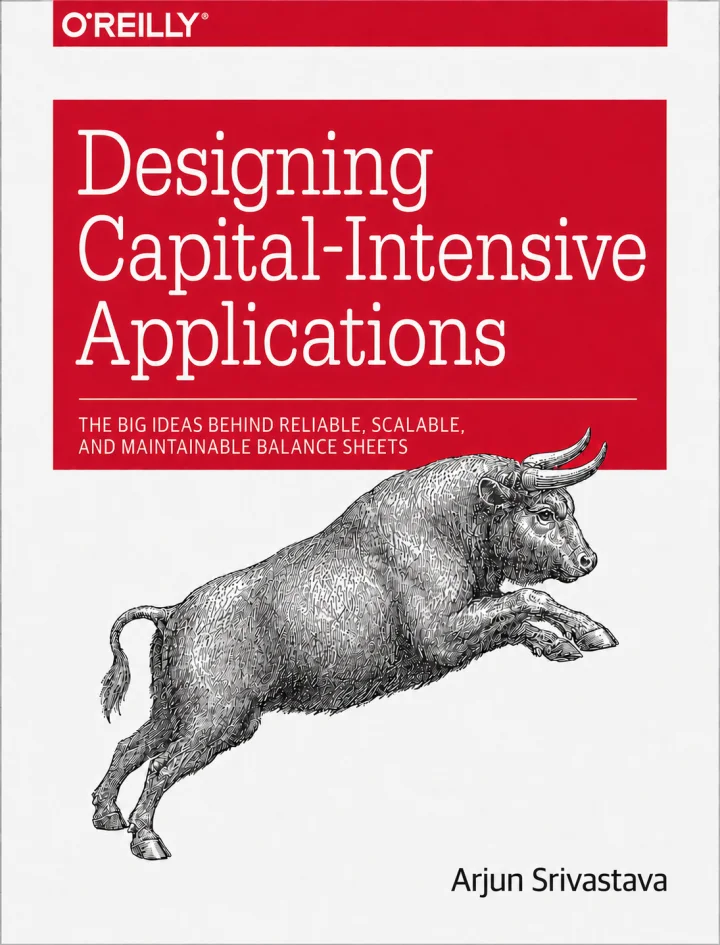

{.cover-art}

Most businesses are financed as if they were static objects.

A capital provider looks at an entity, its history, its assets, maybe a personal guarantee, and prices a claim against the whole thing.

But a business is not a static object. It is a system of cash flows: revenue cohorts, receivables, inventory turns, payroll cycles, ad spend, refunds, cloud commitments. Those flows are becoming machine-legible because payments, billing, banking, and accounting increasingly run through software.

That changes more than underwriting. It can change the **unit of financing itself**.

Capital can stop attaching only to entities and start attaching to observed economic processes, through claims whose behavior responds to live telemetry rather than only to information available at origination.

The infrastructure for moving money is increasingly mature. The layer that decides **who gets paid, when, out of which flows, under what conditions, and with what rights** is much less developed.

```text
┌─ claims layer ──────────────────────────────────────────┐
│  who gets paid, when, out of which flows,               │
│  under what conditions, with what rights                │
└─────────────────────────────────────────────────────────┘
              ▲ observes state, attaches claims to flows
┏━ money and payments OS ━━━━━━━━━━━━━━━━━━━━━━━━━━━━━━━━━┓
┃  payments, billing, balances, payouts, fraud,           ┃
┃  banking interfaces, programmable money movement        ┃
┗━━━━━━━━━━━━━━━━━━━━━━━━━━━━━━━━━━━━━━━━━━━━━━━━━━━━━━━━━┛
              ▲ moves and stores money
╔═ settlement rails ══════════════════════════════════════╗
║  card networks, ACH, wires, RTP, stablecoins            ║
╚═════════════════════════════════════════════════════════╝
```

The argument comes from an analogy with database history. Databases provide an unusually clear example of what happens when changes in workloads and underlying infrastructure make previously impractical architectures suddenly worthwhile.

The compressed version is this: financial instruments are workload-specific architectures. Their feasible design space depends on the infrastructure underneath them. Observability is one of those infrastructure primitives, and it is improving dramatically. As observation and servicing become cheaper, data can move from merely pricing contracts to defining their behavior. And that can eventually change the financeable object itself, from firms and assets toward increasingly granular economic processes.

Not merely **"lending gets more efficient,"** but **"the objects capital can attach to become smaller, more dynamic, and more precisely shaped."**

## A business is a system of flows

A useful starting definition is that a business is a probabilistic system of cash, risk, and value flows across parties over time.

Customers pay money in. Employees, suppliers, lenders, investors, and governments receive money out. Inside the company, capital passes through sales, inventory, payroll, billing, treasury, customer acquisition, infrastructure, and R&D. All of these evolve through time under uncertainty about demand, costs, timing, default, and competition.

Financial instruments shape this system. Debt, equity, convertibles, revolvers, leases, insurance, and hedges answer different versions of the same questions: who bears which risk, who receives which cash flow, with what priority, for how long, under which states of the world, and with what control rights?

A financial instrument is ultimately a claim, and a claim can be described along a few dimensions: **priority, duration, contingency, transferability, and control rights**. Much of financial innovation consists of changing one or more of those dimensions while building enough machinery around the result to make it usable.

There is no universally best financial instrument. There is a financial architecture that fits a particular economic workload.

A predictable stream can support fixed debt service in a way uncertain R&D cannot. A retailer with a temporary inventory mismatch has a different capital problem from a startup financing a decade of product development. A company holding high-quality receivables can be economically healthy while still running out of cash because the timing of inflows and outflows does not match.

Finance also deliberately creates mismatch. Banks borrow short and lend long. Securitization turns illiquid assets into liquid claims. Leverage places fixed obligations against uncertain future cash flows.

So the design problem is not simply "match everything." It is deciding which risks should be matched, which can be transformed, and which party is best equipped to bear what remains.

That begins to look a lot like systems design.

## What database history actually teaches

Database history is often told as a sequence of inventions. It is more useful to read it as a sequence of responses to changing cost ratios and workload shapes.

When disk seeks were catastrophically expensive, wide page-aware trees made sense. When analytical scans became important, column-oriented storage made sense. When write-heavy workloads collided with expensive random writes, buffering and sequentializing writes became attractive. When cheap durable object storage and elastic compute arrived, the old assumption that storage and compute should always live together weakened.

The previous architectures were not necessarily wrong. The environment changed.

The load-bearing lesson is simple:

> **New workload + new cost structure → new useful primitive.**

Nobody invented the LSM tree because it was clever in the abstract. It became useful because the cost structure of the world shifted underneath the B-tree.

Finance has its own equivalent of hardware economics. Its constraints are information, enforcement, settlement, computation, servicing, market depth, transferability, and coordination.

And it has its own primitives.

Collateral attaches a promise to recoverable value. Covenants embed conditional control. Seniority determines who absorbs loss first. Netting reduces gross obligations to net exposure. Pooling and tranching reshape a distribution of cash flows and losses. Bankruptcy-remote vehicles separate a pool of claims from the fate of its originator.

The analogy is loose by design. Netting is not literally compaction. Repo is not literally a cache. Limited liability has no database equivalent worth forcing.

The useful point is that both fields advance when an underlying constraint changes enough to make a new abstraction operationally worthwhile.

There is also an important difference between inventing a financial primitive and making it real. Financial instruments need institutional machinery around them.

Joint-stock equity needed courts, registries, accounting conventions, disclosure, and governance. Securitization needed SPVs, servicers, trustee law, funding markets, and conventions for understanding the resulting claims.

The durable object in finance is therefore usually:

> **instrument + institutional machinery**

A useful name for that combination is a **capital substrate**.

Bank deposits, public equity, corporate bonds, repo, securitization and other enduring structures matter not merely because someone invented a useful claim. Institutions accumulated around those claims until they became legible, enforceable, serviceable, fundable and, where useful, transferable at scale.

A claim can therefore be intellectually designable long before it is economically serviceable.

Humans have always been able to write complicated state-contingent contracts. The harder questions are whether the relevant state can be observed cheaply, whether the consequence can be calculated reliably, whether the contract can be administered thousands of times, whether exceptions can be handled, whether it can be enforced, and whether counterparties can trust the underlying data.

That is where software starts to matter.

## What becomes financeable next?

In databases, changing infrastructure repeatedly changed the practical unit of computation.

In finance, cheaper observation, computation, enforcement, and servicing can change the practical **unit of financing**.

That is the frame. Not that lending gets more efficient, but that the financeable object itself becomes smaller and more dynamic.

One obvious consequence is **flow-level finance**. Capital can attach to specific streams: seller cohorts on a marketplace, SaaS revenue vintages, receivables, royalty streams, contracted usage, or measurable customer-acquisition loops.

The idea itself is not new. Factoring is ancient. Merchant cash advances have linked repayment to payment volume for decades.

What changes is the resolution at which flows can be observed, separated, priced, and controlled.

A second consequence is **closed-loop adaptive finance**. Borrowing bases can recompute more frequently. Repayment can flex with realized cash flow. Limits can expand or contract with measured state. Capital starts to look less like something negotiated once every quarter and more like something operated as a control loop.

A third consequence is that observability can make some intangible businesses easier to finance.

Software companies are rich in things lenders find difficult to seize: code, customers, data, distribution, workflows, intellectual property. Telemetry cannot manufacture recovery value. A dashboard is not collateral.

But high-resolution observation, control of the underlying flow, and the ability to constrain incremental exposure can perform risk-control functions that coarse information regimes historically forced lenders to approximate through hard collateral and static covenants.

A lender who sees every transaction and controls the payment rail does not occupy the same position as one who receives financial statements once a quarter.

Another consequence is **state-contingent finance**: staged capital releases, milestone-linked funding, dynamic borrowing bases and other structures in which the availability of capital responds to measured state.

Closely related are **programmatic liabilities**: automatic cash sweeps, contingent conversion, dynamic subordination and event-driven waterfalls. These do not merely decide whether more capital should be extended. They change how existing claims behave as the underlying state changes.

The contracts themselves were always writable.

> **State-dependent claims have always been designable. They have rarely been cheap to service.**

Someone has to verify the state, calculate the consequence, administer the contract, handle exceptions, reconcile accounts, and enforce the result. Machine-verifiable state changes the economics of doing that repeatedly.

The same logic applies at the level of networks. A marketplace can know the order book, payment history, customers, and expected cash flows of a seller better than an outside bank ever could. A supply-chain platform can observe one participant's position in the context of the whole network.

The financeable object can therefore become a position in a network rather than merely a standalone legal entity.

There is also the possibility of more granular risk transfer. A business contains churn risk, concentration risk, supplier risk, refund risk, FX risk, advertising risk, and input-cost risk. Better measurement does not magically make each exposure independently tradable. Correlation, moral hazard, market depth, and adverse selection still matter. But what cannot be measured cannot be cleanly priced or transferred at all.

And finally, lower fixed costs can open up a long tail of bespoke finance. Every financial product has to be underwritten, documented, monitored, serviced, collected, and resolved when things go wrong. That places a minimum economic size on customization.

If software pushes those fixed costs down far enough, the minimum viable claim shrinks.

A much longer tail of strange economic workloads becomes worth financing.

## The firm may not be the right atomic unit of finance

This is the consequence I find most interesting.

Consider a software company with a mature subscription product, signed enterprise receivables, an experimental new product, a measurable acquisition loop, large cloud commitments, and long-duration R&D.

Those activities have radically different economics.

The subscription product may be highly predictable. The experimental product may have venture-like uncertainty. Receivables may be low risk but create a timing mismatch. Advertising may have measurable but noisy payback. R&D may have no useful near-term cash-flow predictability at all.

Yet all of them often inherit one blended company-level financing structure.

Why?

Partly because the firm is a convenient legal and informational boundary.

Historically, financing smaller pieces separately was expensive. The data was unavailable. The cash flow might not be separable. Administration was costly. The rights were harder to enforce. Nobody wants to spend $100,000 structuring a $50,000 claim.

Software weakens some of those constraints.

```text
                         COMPANY
                            │
         ┌──────────────────┼──────────────────┐
         │                  │                  │
         ▼                  ▼                  ▼
   Subscription         Receivables         New product
      cohort               stream              R&D
   predictable           predictable         uncertain
   recurring             timing gap          long-duration
         │
         ├─────────────┐
         ▼             ▼
   Acquisition     Cloud / infra
      loop          commitments
 measurable         contracted
  payback              spend
```

So why should the legal entity always be the atomic unit of financing?

> **The firm may not be the right atomic unit of finance.**

Or more generally:

> **Information technology can change what counts as a financeable object.**

This does not mean every flow should be independently financed. Fragmentation has costs. Some risks genuinely belong together. Correlations that look weak in normal conditions can become enormous in stress. Legal structure matters. Simplicity has value.

But the technological constraint is weakening.

The progression is something like:

> **company → asset or project → cash-flow stream → economic process**

A retailer's inventory cycle. A SaaS revenue cohort. A marketplace seller network. A pool of contractual receivables. A measurable acquisition loop.

The deeper shift is from financing relatively static entities toward financing observed, evolving processes through increasingly monitored and state-contingent claims.

## Better telemetry should change the contract, not just the model

Most applications of richer financial data still follow the same basic pattern:

> telemetry → model → underwriting decision → mostly static instrument

The data decides whether to lend, how much to lend, and at what price.

But if the underlying process remains observable after origination, why should information stop at underwriting?

A retailer's credit line could respond to inventory sell-through. Repayment could react to realized margins. Capital availability could respond to customer concentration. A SaaS cohort could be financed based on the evolution of that cohort rather than only on the company's consolidated financial state.

Now telemetry is not just helping choose the contract. It is becoming part of the contract's behavior.

```text
                     ┌─ price
                     ├─ limit
observed state ──────┼─ repayment
                     ├─ covenant state
                     └─ capital availability
```

That is a larger idea than better credit scoring.

**Underwriting from telemetry prices an instrument better. Telemetry in the contract can make a different instrument possible.**

A financial claim starts to look like a stateful program over uncertain future cash flows. It has state, transitions, triggers, priorities, rights, and failure conditions.

Underwriting starts to look partly like compilation: observed state, predicted future, uncertainty, cost of capital, policy, and risk constraints become an executable claim.

The metaphor is imperfect. The distinction is still useful.

## A clever claim is not enough

A workload does not become financeable because someone can sketch an elegant contract.

The whole system has to work: underwriting, monitoring, data integrity, legal enforceability, servicing, funding, incentives, stress behavior, and sometimes liquidity.

Finance runs its chaos experiments on a decade delay.

A structure can work beautifully for years before the environment finally produces the state in which its hidden assumptions matter.

Telemetry-driven claims create obvious failure modes. What happens when the telemetry is wrong? When the platform goes down? When the metric definition changes? When borrowers learn to manipulate the metric? When every borrower deteriorates at once?

Adaptive contracts can also become procyclical. A system that automatically tightens credit as conditions deteriorate may amplify the stress it is reacting to. Margin spirals are an old version of the same control problem.

So the frontier is not:

> more data → more complicated finance

It is:

> **better infrastructure → a larger set of financial architectures whose benefits can justify their complexity**

A great deal of financial "innovation" is fake progress. It merely moves risk into the tails, into leverage, into opacity, into fragile liquidity assumptions, or onto less informed counterparties.

Technology does not repeal economics.

It changes which tradeoffs are worth making.

## From payments to claims

Modern fintech has spent enormous effort making money programmable.

Payments became APIs. Billing became software. Balances, payouts, fraud, treasury, and settlement increasingly live inside programmable systems.

That is the transport layer.

A claim answers a different question: who gets paid, when, from which flow, with what priority, under what conditions, who absorbs the loss, and which rights activate when state changes?

Payments determine **how** money moves.

Claims determine **why it moves that way**.

If economic activity becomes machine-legible and money movement becomes programmable, it seems natural that infrastructure emerges between operational software and capital providers.

Its job would be to turn economic processes into claims that can be observed, underwritten, monitored, serviced, enforced, funded, and perhaps eventually transferred.

Call the long-run version a **claims layer**.

The name matters less than the category distinction.

A real claims layer would need to do several things at once. It would have to identify financeable subsystems inside a business, attach an appropriate claim to each one, monitor their state continuously, alter limits or terms when the contract requires it, decompose different kinds of risk, and expose the resulting capital structure as something an operator can actually understand and manage.

The end state is a world in which capital starts to behave a little more like compute: different workloads can receive different resources, capacity can respond to load, and the architecture can be changed at a finer level than the whole company.

This is not merely software recommending which loan a CFO should choose.

A dashboard that recommends financing may be useful, but it is not the thesis.

In database terms, that is the admin panel.

> **The interesting layer is the storage engine: the machinery that makes a previously impractical primitive work.**

And that machinery is only partly software. It also includes underwriting, legal wrappers, servicing, standards, funding interfaces, enforcement, and eventually perhaps market infrastructure.

There is another workload that pushes in the same direction: machine counterparties.

Software agents cannot take a banker's call, rely on an informal understanding of a covenant, or negotiate exceptions over dinner. If autonomous agents become economically meaningful actors, financial relationships increasingly need machine-readable state, explicit triggers and programmatic execution.

Programmability stops being aesthetic and becomes part of the interface.

## A claims layer is a data platform with legal consequences

Strip away the finance vocabulary and much of this starts to look like a data-platform problem with unusually consequential outputs.

If telemetry defines financial rights, then data quality becomes credit risk. Pipeline lag becomes economic risk. Schema drift can change a covenant's meaning. Lineage becomes evidence. Correction and replay semantics matter. Permissions become financial controls. Model and data versions become part of auditability.

The output of the data system is no longer merely a recommendation or dashboard.

It can become an enforceable obligation.

That means a claim depending on telemetry needs answers to questions familiar to any serious data-platform engineer. What exactly does this field mean? Which system produced it? Which version of the calculation was used? What happened when data arrived late? Can the state be reproduced? Which information was visible when the decision was made? What happens when two sources disagree?

Whoever builds this machinery may spend less time inventing exotic instruments than making operational data trustworthy enough to hang financial rights on.

## The market is already converging on the boundary

If the argument is right, we should not expect a finished "claims layer" company to suddenly appear from nowhere.

We should expect adjacent markets to start moving toward the same boundary from different directions.

That is roughly what the market looks like.

Embedded-capital providers such as **Parafin, Pipe, Liberis, Fundbox, and Kanmon** begin close to underwriting, funding, and platform distribution. Their natural direction of travel is deeper integration with the operating data of the businesses they finance.

Companies such as **Wayflyer, Settle, and Founderpath** begin with narrower economic workloads: e-commerce working capital, inventory and cash conversion, recurring software revenue. Their advantage is knowing one class of flow unusually well.

Trade-credit and B2B payment companies such as **Slope, Resolve, TreviPay, and Tranch** begin inside the transaction itself, where payment terms create the financing need.

Meanwhile **Mercury, Brex, Ramp, and Rho** begin from banking, spend, treasury and workflow. They own increasingly rich operational state but start farther away from claim design.

And companies such as **Stripe and Shopify** occupy particularly interesting positions because they combine large distribution surfaces with transaction telemetry and some degree of control over money movement.

These do not look like members of one category because they did not start from the same workload.

The useful way to read the field is as a **convergence race**.

One group starts with capital relationships and needs deeper software and telemetry. Another starts with software, workflow and data and needs underwriting, servicing and funding machinery. Vertical players start with unusually deep knowledge of one flow and may expand outward from there.

They are moving toward a similar boundary:

> **software that can observe an economic process closely enough to attach capital to it.**

The interesting competitive question is therefore not simply which companies sell comparable products today.

It is **which starting position can assemble the rest of the capital substrate first**.

That framing also says something about where demand should appear earliest.

The natural first consumer of this infrastructure is often not the individual business. It is the platform already intermediating the flows of many businesses.

A vertical SaaS platform, marketplace, commerce network or B2B transaction platform already has three things an outside capital provider struggles to acquire: workflow position, distribution, and high-resolution operational telemetry.

If capital mismatch limits the throughput of that ecosystem, financing stops being an unrelated financial product and becomes part of the platform's operating architecture.

That is why embedded capital keeps appearing in platforms rather than only in banks.

The market is not yet proof of the full thesis. Most of these products still use telemetry primarily to make better decisions about relatively conventional claims.

But that is exactly what an infrastructure transition should look like early on.

The new primitive first appears as a better implementation of the old thing.

Only later does it become obvious that the underlying design space changed.

## What is durable, and what is still uncertain

The pieces of this argument have different confidence levels.

The strongest claim is that software is changing the information and servicing economics of finance. Businesses produce far more machine-readable state than they did before, money movement is increasingly programmable, and financing is already appearing closer to the workflows that generate the underlying cash flows.

I am also reasonably confident that more financing becomes flow-specific and state-aware as a consequence.

The more speculative step is how far telemetry moves from underwriting input into contract logic, how granular financeable objects ultimately become, and whether the resulting claims become transferable enough to constitute genuinely new asset classes.

And I am much less confident about what company boundary ultimately captures the value. The winner may begin as software, a lender, a platform, or market infrastructure. "Claims layer" is a useful description of the missing machinery, not a prediction that the market will use that name.

The historical pattern is what gives the thesis weight.

The primitive becomes possible first.

The institutional stack forms around it later.

## Eight conclusions

The whole argument compresses into eight claims.

**The firm is not necessarily the right atomic unit of finance.** Increasingly observable economic processes can become financeable objects in their own right.

**Better underwriting is not the main unlock.** The stronger possibility is that better data changes the instrument itself.

**Observability can reduce reliance on some functions of collateral.** It cannot create recovery value, but it can improve monitoring, control, and exposure management.

**The next frontier is claim design, not merely fintech UX.** Distribution improvements matter. New primitives matter more.

**Better rails are not the endgame.** Payments move money. Claims encode rights over money.

**Platforms occupy a privileged position.** They increasingly own the combination of workflow, telemetry and distribution from which finer-grained financing can emerge.

**A lot of financial innovation is fake progress.** Many innovations merely relocate risk into complexity, leverage, liquidity assumptions, or the tails.

**The next major capital substrate may look boring at first.** Embedded working capital, receivables, platform financing, dynamic limits, mundane operational integrations.

The B-tree did not look like a revolution either.

It looked like a way to do fewer disk seeks.

Financial infrastructure has spent decades making money easier to move.

The next question is what happens once the economic processes generating that money become equally machine-legible.

Database history suggests that when workloads and underlying cost ratios change enough, the natural architecture changes with them.

Today, capital mostly attaches to firms, assets, and broad pools.

Tomorrow, more of it may attach directly to observable economic processes.

**The interesting frontier is not merely better models for old financial instruments. It is discovering which new claims become possible when the economy itself becomes machine-legible.**
