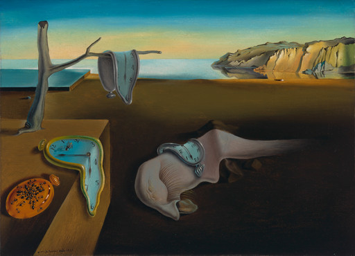

I wanted to share a few things that I have been working on.

LLMs, chatbots, and agents have been a huge blessing for me. They let me learn as much as I want, pick up topics I find interesting, bounce ideas around, talk through what I think, and build things that I might once have found too tedious.

They also let me leave something in a chat window without having to keep all of it in my head. I can disconnect from it for a while and come back later. They help me draft messages, think through different scenarios, and look at something through another reader's eyes. Often, I can start by saying what I want instead of describing every step, then look at the result and keep going.

But I have problems.

One of them is that once I feel I have made decent progress on something, I often lose the motivation to keep going. This has been true for a long time.

One of my favorite classes in college was discrete mathematics. It was supposed to be difficult, and many people did not enjoy it, but I found it fascinating. The difficult questions held my attention because I had to find my own way through them. When the final exam included questions whose method already felt clear, I found myself doing the hard ones first and putting off the easy ones, even though they still had to be done.

Computer-architecture labs exposed the same pattern in a different way. Each exercise introduced a few new ideas. Moving from one question to the next meant figuring out the main complication, but it could also mean copying and wiring dozens of components, followed by twenty minutes of pointing and clicking. I liked finding the core solution. Once I had it, my lab partner often helped close the loop on the manual work that remained.

In many ways, this has been the boon of LLMs. They let me focus on the part I find interesting while helping hold the context and keep the execution moving.

This works to an extent, especially while a conversation is active. The problem appears when I return months later.

Between January 2023 and July 2026, my AI conversation archive accumulated 6,604 conversations: 100,694 message turns and 35.7 million words. They contain architectural designs, codebases, operational decisions, abandoned experiments, and technical trade-offs that exist nowhere else.

Returning to that history requires more than finding an old passage. I need to know which fragments belong together, whether the code still exists, what actually ran, which version is current, and what I should do next.

That last question is why I built this system. My recurring problem was not forgetting trivia; it was failing to close loops. I would solve the core technical challenge of a project, get it to 80% or 90% completion, stop, and leave several partial implementations scattered across repositories and chat sessions. Later, I remembered only the feeling that I had done substantial work without a durable artifact to show for it.

Search recovered the scattered pieces. It did not tell me what those pieces meant.

The system therefore grew from a search pipeline into a closed loop:

```text
raw history ──▶ evidence ledger ──▶ task projections ──▶ reusable state
      ▲                                                           │
      └──────────────── corrections / new artifacts ──────────────┘
```

Search finds material related to a question. Memory is the machinery that works out what the material refers to, what it can prove, what is current, how it should be represented for a specific task, and what is worth carrying forward.

Each question emerged as more of my working context accumulated in conversations. Finding the text was the first problem. Recovering the state required progressively more machinery.

The distinction becomes clear through six progressive questions and the output each one produces.

## The workload: questions that cross threads

The archive spans six sources, but the volume is heavily skewed:

```text
words per source

AI Studio   ║████████████████████████████████████  20.5M
Claude      ║███████████████                       8.5M
ChatGPT     ║█████████                             5.0M
Cursor      ║██                                    1.1M
Codex       ║█                                     0.5M
Claude Code ║·                                    0.04M

· below one bar cell at this scale
```

*(Word counts are measured directly from normalized message text. Model token counts vary depending on tokenizers, chunk boundaries, and prompt overhead.)*

AI Studio accounts for roughly 57% of the total words despite representing only 20% of the conversations. Measuring corpus size purely by thread count hides where the substantive technical weight lives.

Querying this corpus requires answering six progressively harder questions:

```text
FIND          Where was this discussed?
  │
  ▼
IDENTIFY      What durable entity does it belong to?
  │
  ▼
ESTABLISH     What claims can this evidence actually support?
  │
  ▼
RESOLVE TIME  Which state is current?
  │
  ▼
PROJECT       What representation does this specific task need?
  │
  ▼
PROMOTE       Should this result become reusable memory?

search → identity → authority → time → projection → memory
```

Each stage must produce an inspectable artifact. Otherwise, "memory" remains an architectural diagram with no visible payoff.

## Question 1: Can I find the work again?

The first version was standard search: normalize conversation exports into flat files, index full text with SQLite FTS5, and generate vector embeddings for semantic retrieval.

These two retrieval modes solve distinct problems:

* **Exact search** works when you know the handle: an internal project codename, an exact error string, a function identifier, a library, or a person.
* **Semantic retrieval** works when vocabulary has drifted: finding an architecture concept discussed three years ago using different words.

Before either could work reliably, the source formats had to become comparable.

### Normalizing six conversation formats

Each source platform exports an incompatible data model with its own edge cases:

| Source | Export failure mode & Normalization fix |
|---|---|
| **ChatGPT** | Conversations are tree DAGs, not linear lists. Adapters walk parent pointers backward from active leaf nodes to reconstruct the intended branch. |
| **Claude** | Schemas shifted from flat message arrays to nested content blocks across platform generations; adapters route through version-specific AST decoders. |
| **AI Studio** | Batches overlap and lack message-level timestamps; adapters deduplicate by turn hashes and reconstruct dates from HTTP payload metadata and file modification times. |
| **Coding agents** | Tool calls, terminal outputs, and session resumptions must be parsed into typed execution events rather than noisy raw prompt text. |

Source adapters parse raw exports, convert them into a uniform schema, and attach permanent locators (`source_id`, `conversation_id`, `turn_index`). 

This establishes a core invariant:

> **A search index should be disposable. The evidence it points to should not be.**

### Example Output: Multi-Surface Retrieval

When I queried the archive during a loop-closure pass on LeJEPA (a joint-embedding predictive architecture experiment), conversation and filesystem search recovered six distinct implementation surfaces scattered across tools and repositories:

```text
Query:    "LeJEPA joint-embedding predictive architecture"
Matches:  6 distinct implementation surfaces
          - Python and C++ toy implementation
          - Orphaned React browser prototype
          - Browser-native jax-js port
          - Fashion-MNIST multi-view experiment
          - Novus publication integration
          - Weight-noise experimental fork
```

Search recovered the scattered fragments across tools. But it could not tell me if those fragments belonged to the same logical project, which codebase was authoritative, or whether any of them worked.

Search generated candidates. It had no concept of identity.

## Question 2: Which conversations belong to the same thing?

A conversation makes a good transport container and a poor semantic identity.

A single project often spans dozens of threads and shifting codenames. Conversely, a single long thread can wander across multiple distinct projects. A thread title generated from the opening prompt rarely describes the work done twenty turns later.

If the system treats a conversation as the unit of meaning, project-level questions fail: work is split across aliases, duplicate records proliferate, and thread drift corrupts historical queries.

### Canonical entity reconciliation

To fix this, an offline pipeline extracted candidate aliases by analyzing co-occurrences in commit messages, repo paths, and thread titles, generating a cluster graph of potential project handles. After human review, I locked these clusters into a canonical registry, consolidating 300 raw identifiers down to 249 canonical projects.

A canonical project record requires:
- **Aliases** (historical codenames, repo names, thread handles);
- **Evidence links** mapping back to specific conversation turns;
- **Maturity state** (e.g., *concept*, *prototype*, *production*, *abandoned*);
- **Temporal boundaries** (first active date, last active date);
- **Relationships** to other projects;
- **Provenance rationale** documenting *why* two aliases were merged.

Canonicalization answers:
> *Do these records refer to the same durable thing?*

However, entity resolution only works for things you explicitly named. It cannot identify unstated thematic patterns across the corpus.

### Discovering unstated structure with contrastive clustering

Hundreds of conversations across seemingly unrelated projects often share latent concerns: evaluation harnesses, long-running agent workflows, organizational structure, memory systems, or data contracts. These themes were never given formal labels while the conversations were happening.

Anthropic’s Clio research provided a useful design for discovering this kind of bottom-up semantic structure. I reimplemented the hierarchy-generation idea, omitting their institutional privacy system.

The pipeline extracts a model-generated facet for each conversation (such as the core user intent), embeds the facets, and clusters them.

Crucially, base clusters are **named contrastively**: representative cluster members are shown alongside nearby non-members so the model describes what makes the cluster distinct, not merely what its members have in common.

Higher levels are generated bottom-up: cluster descriptions are embedded, grouped into neighborhoods, proposed as candidate parent nodes, deduplicated, assigned children, and finally **renamed only after knowing which children they actually received**:

```text
6,604 conversations
        │ generate one facet each
        ▼
┌─ facets ─────────────────────────────────┐
└─────────────────────┬────────────────────┘
        │ embed, cluster
        ▼
┏━ base cluster ━━━━━━━━━━━━━━━━━━━━━━━━━━┓
┃  named against nearby non-members,      ┃
┃  so the name says what it excludes      ┃
┗━━━━━━━━━━━━━━━━━━━━━┯━━━━━━━━━━━━━━━━━━━┛
        │ embed names, propose parents, assign children
        ▼
┏━ parent cluster ━━━━━━━━━━━━━━━━━━━━━━━━┓
┃  renamed from the children it received  ┃
┗━━━━━━━━━━━━━━━━━━━━━━━━━━━━━━━━━━━━━━━━━┛
```

Two steps prevent semantic drift: **naming a cluster against what it excludes**, and **naming a parent node only after its children are finalized**.

This semantic index and the canonical entity map solve distinct problems:

| Question | Structure |
|---|---|
| Do these records refer to the same durable thing? | Canonical entity |
| What recurring semantic structure exists across many records? | Generated hierarchy |

The two mechanisms intersect without collapsing into each other:

```text
source records             canonical identity       semantic views

conversation A ─┐
conversation B ─┼─ same thing ─▶ Project P ─┬─▶ theme: memory systems
conversation C ─┘                           └─▶ theme: publishing

conversation D ─── same thing ─▶ Project Q ───▶ theme: memory systems
```

Identity collapses aliases into one durable object. Categorization projects that object into several useful views. 

### Example Output: Canonical Entity & Relationship Discovery

Canonicalization must avoid over-merging. Companion tools and related codebases must remain separate entities connected by explicit, typed relationships rather than being collapsed into a single alias:

```text
C065 — LeJEPA Interactive Demos
        browser experiments, visual explanation, publication surfaces

                    pairs_with
                         │
                         ▼

C234 — Pure Python LeJEPA Training
        minimal reproduction and implementation study
```

The entity map resolved project boundaries and relationships. But it still could not tell me if any of those projects had shipped working code.

## Question 3: What did I build rather than discuss?

Conversations are unusually rich evidence of thought. They are much weaker evidence of outcome.

A design may never reach code. A remembered result may use the wrong denominator. An assistant can propose a compelling architecture that was immediately discarded. A plan can be discussed repeatedly and still never happen.

This distinction becomes critical when moving from:
> *What was I thinking about?*

to:
> *What did I build?*  
> *Which decision did we actually make?*  
> *What evidence supports this claim?*

Chat provides candidate claims. Proving outcomes requires external systems of record.

### Grounding chat in external evidence

Harder operational questions required integrating additional evidence sources:

::: {.table-responsive}

| Evidence family | What it can establish |
|---|---|
| **GitHub & local repositories** | Code execution: commits, PRs, diffs, release tags, and version lineage |
| **Jira & Confluence** | Delivery state: ownership, decisions, rejected alternatives, and review history |
| **Slack & calendar** | Operational cadence: collaboration context, meeting decisions, and real chronology |
| **Finished artifacts** | Durability: finalized RFCs, datasets, technical essays, PDFs, and releases |

:::

These sources arrive via historical exports, scheduled API syncs, or authenticated fetches via a sandboxed browser. All sources conform to the same versioned record contract.

The core architectural invariant is that **every record retains sufficient provenance for downstream queries to evaluate its evidentiary weight.**

### Evidence is not interpretation

Retrieval asks: *What evidence exists?*  
Authority asks: *What can this evidence establish?*

The state model strictly decouples three layers:

```text
╔═ evidence ledger ══╗   ┌─ interpretation ─┐   ┏━ accepted state ━┓
║ source evidence in ║──▶│ reads several    │──▶┃ reviewed current ┃
║ a named revision   ║   │ records          │   ┃ view             ┃
╚════════════════════╝   └──────────────────┘   ┗━━━━━━━━━┯━━━━━━━━┛
           ▲                                              │
           └────────── correction, as a dated record ─────┘
```

A conversation proves that text appeared in a named source revision. A model-generated summary interprets several records. A reviewed project record becomes the accepted current view. Authority never transfers automatically across these boundaries, and human corrections re-enter the system as new dated evidence rather than overwriting history.

This separation prevents LLMs from flattening distinctions. A fluent summary can easily make a plan, a suggestion, a speculative idea, and a deployed production release sound equally factual unless their underlying evidence types remain distinct.

### Evidence has types

Different records support different claims:

* **First-person assertions** prove what someone claimed or remembered at a point in time.
* **Assistant suggestions** prove a proposal was surfaced, not that it was accepted or implemented.
* **Commits and diffs** prove code changed.
* **Tickets** prove operational ownership and delivery status transitions.
* **Released artifacts** prove durable delivery.

Numerical claims require explicit provenance tags:
* `measured` (derived directly from benchmark logs or profiling runs);
* `remembered` (quoted from memory during conversation);
* `reconstructed` (recalculated after the fact);
* `targeted` (a performance goal);
* `hypothetical` (an illustrative example).

The same rigor applies to negative search results. *"I found no matching artifact in the searched sources using these parameters"* describes an empirical search operation. *"This artifact does not exist"* makes an absolute factual claim search alone cannot guarantee.

### Example Output: The Maturity Audit

Inspecting the evidence for LeJEPA separated running code from conversational proposals:

```text
Component                Inspected Evidence          Maturity Decision
───────────────────────────────────────────────────────────────────────────
Python / C++ Core        Repo commits, clean tests   Implemented
WebGL Browser Port       Single-file HTML/JS canvas  Working prototype
Fashion-MNIST Run        Training logs, loss curves  Completed experiment
Speculative Extensions   Chat proposals only         Concept (not built)
```

This same evidentiary discipline applies across systems. [**OMA**](https://www.novusopus.org/oma/) has inspectable implementation, dated commits, and a working public surface, supporting *built prototype*. [**`pg_llm`**](https://www.novusopus.org/research/quantitative-qualitativeness/) has a substantial design corpus, public specification, and implementation sketches, but the inspected evidence did not establish every proposed semantic primitive as shipped, supporting *designed architecture*.

Now I had code, commits, and conversation records linked to canonical entities. But multiple conflicting records claimed to represent the "current" architecture. The system could not resolve temporal supersession.

## Question 4: Which version is current?

The newest record is not always the most complete.

During one ingestion run, a fresh ChatGPT export contained 174 conversations that were significantly shorter than the versions already stored in the archive.

Whether caused by branch selection bugs, server-side data retention issues, or export format shifts, automatically overwriting existing records with the latest download would have permanently destroyed detail.

The importer retained the new export, but quarantined those 174 records from promotion:

```text
raw arrival
    │ normalize
    ▼
╔═ evidence ledger ════╗
║ immutable snapshot   ║
╚══════════╤═══════════╝
           │ compare against known revisions
     ┌─────┴──────┐
     ▼            ▼
┌─ retained ─┐  ┌╌ quarantined ╌╌╌┐
│  revision  │  ╎ 174 shorter     ╎
└─────┬──────┘  ╎ copies          ╎
      │ promote └╌╌╌╌╌╌╌╌╌╌╌╌╌╌╌╌╌┘
      ▼
┌─ current view ─┐
│  replaceable   │
└────────────────┘
```

This established four distinct lifecycle concepts:

* **Raw arrival:** The exact byte payload received from an export or webhook at a specific timestamp, stored as a content-addressed JSON blob on disk.
* **Immutable snapshot:** An unmutated archive entry in the evidence ledger. If normalization parsers change, they can be rerun across historical snapshots without data loss.
* **Retained revision:** The specific parsed version selected as the most complete historical representation.
* **Current view:** A disposable relational pointer in SQLite pointing to the currently accepted best state.

### Example Output: Revision Quarantine

In one verified instance, a 250-message conversation regressed to 179 messages in a subsequent export. The temporal engine preserved the fuller past:

```text
Observation               Revision ID    Messages    Bytes     State Decision
───────────────────────────────────────────────────────────────────────────
Prior Retained Version    4e8fe683...    250         146 KB    Active Current View
Later Exported Version    3d0bf4cf...    179          81 KB    Quarantined (Held)
```

The system did not decide that the shorter revision was false. It refused to let an ambiguous later arrival destroy a fuller historical record. The same ingest held 174 shorter revisions from promotion.

### Unified batch and incremental capture

Large batch exports handle historical backfills; webhooks and authenticated API pulls provide real-time freshness.

While their transport layers differ, both converge on the same immutable record contract. In one test, capturing an evolving conversation twice appended eight new messages while retaining the previous snapshot intact, making the delta inspectable rather than implicit.

### Current state is typed

Current state is an evaluation over dated evidence. Different operational entities follow distinct transition rules:

* **Decisions** are superseded by newer records.
* **Commitments** transition between *open*, *completed*, and *abandoned*.
* **Preferences** decay gradually over time rather than flipping boolean states.
* **Projects** advance through explicit maturity tiers.
* **Artifacts** move from *draft* to *published*.

Historical evidence remains frozen; the derived interpretation updates.

At this point, the system knew what existed, what was built, and what was current. But when I tried to use this state, a new failure appeared: no single summary of this data could satisfy different tasks.

## Question 5: What view does this task need?

A common architecture trap is attempting to build a single "consolidated world model"—one massive summary of all projects, decisions, and knowledge intended to serve every future query.

In practice, this fails in both directions:
1. **Exhaustive summaries** become bloated, brittle, and prohibitively expensive to maintain.
2. **Aggressively compressed summaries** discard granular evidence that future operational queries end up needing.

The fundamental issue is that **different tasks require fundamentally incompatible representations of the same underlying history.**

### Relevance is task-conditioned

Consider four distinct projections derived from the same project history:

```text
same project history
        │
        ├─ year-in-review
        │    → temporal deltas, major shifts, recurring themes
        │
        ├─ unfinished-work queue
        │    → maturity state, blockers, actionable next steps
        │
        ├─ technical narrative
        │    → architectural decisions, failure modes, benchmark lineage
        │
        └─ publication plan
             → novelty, claims, confidentiality, artifact completeness
```

All four projections are accurate, yet they prioritize disjoint subsets of the underlying data.

Relevance cannot be evaluated as an intrinsic property of a text chunk. It is a function of context:

```text
usefulness(record | task, reader, time, authority, proof obligation)
```

Vector similarity provides an initial candidate filter, but cannot evaluate audience requirements, temporal authority, or evidentiary burden on its own.

### Example Output: Dual Task Projections

From the same stable baseline of 249 canonical projects, two operational questions produced materially different finished outputs:

```text
Stable Input:  249 Canonical Projects

Projection A:  "What patterns shaped my work across AI tools?"
               -> Year-in-Review: 2,255 conversations analyzed across time and themes.
                  - pipeline archaeology as the largest theme by word mass
                  - a recurring accumulation of nearly finished drafts

Projection B:  "What is the public editorial disposition of each project?"
               -> Mining Plan: 249 projects fully accounted for, including 62 backing
                  completed shorts, 24 scheduled flagships, 7 existing public assets,
                  and 0 still awaiting an editorial disposition.
```

The year-in-review made a recurring pattern legible. The publishing portfolio turned the same history into decisions. Neither projection replaces the underlying evidence base; each compiles a temporary view shaped for the reader at hand.

### Dynamic semantic lenses with OMA

Often, the grouping axis required by an operational task does not exist in the precomputed index. A static topic index might partition conversations into *search*, *robotics*, or *writing*, but a task may need to partition by *maturity*, *execution risk*, or *claim strength*.

A static topic index cannot become a maturity index simply by reranking clusters; the task demands an orthogonal grouping axis.

Clio supplied a way to discover bottom-up structure. John Maeda’s *The Laws of Simplicity* and SLIP supplied a different concern: how a person finds orientation in that structure without already possessing the organizer’s mental model. Organization should reduce apparent complexity, reveal useful waypoints, and remain responsive to the purpose that brought someone to the information.

I built [**OMA**](https://www.novusopus.org/oma/) in November 2025 at the intersection of those ideas. OMA rejected the assumption that personal archives should have one permanent taxonomy. Instead, it generates transient taxonomies on the fly from user intent:

```text
Input collection:
  Project A — extensive implementation notes, no public release
  Project B — speculative architectural brainstorming
  Project C — completed benchmark logs, unpublished draft

Intent:
  "What should I publish next?"

Generated lens:
  [novelty, evidence_strength, public_readiness, remaining_effort]

Resulting projection:
  Project C (ready) > Project A (needs writeup) >>> Project B (speculative)
```

### Composing exact and semantic queries with `pg_llm`

While OMA solved dynamic lens generation on the intent plane, running those lenses over large archives created a computational problem on the execution plane: operational queries mix exact relational mechanics with semantic language judgment.

Relational engines excel at timestamps, foreign key joins, metadata filters, and set operations. Language models excel at qualitative judgment: classifying maturity, extracting action items, or identifying contradictions.

Quantitative qualitativeness began from the opposite direction. Ordinary analytical systems could count, filter, join, and group evidence precisely, but had no ordinary operator for its qualitative meaning. In February 2025, inspired by Benn Stancil’s `AVG(text)` concept, I designed **`pg_llm`** (documented as [**Semantic SQL**](https://www.novusopus.org/research/quantitative-qualitativeness/)) to put those two kinds of computation inside the same query:

```sql
SELECT canonical_project,
       llm_agg_jsonb(source_evidence, 'extract unresolved blockers and next actions') AS task_state
FROM evidence_ledger
WHERE last_active_at > NOW() - INTERVAL '6 months'
GROUP BY canonical_project;
```

This treats language model inference as a composable database operator. SQL handles relational boundaries, filtering, and grouping; the language model handles qualitative synthesis over the grouped evidence.

OMA and `pg_llm` originated independently—one from human information design, the other from relational analytics. Together, they form the two halves of a task-conditioned query plane: OMA generates the semantic lens from human intent, while `pg_llm` provides the hybrid execution contract.

### The agent as an adaptive query planner

Fixed retrieval pipelines (`embed → retrieve → rerank → generate`) fail when intermediate evidence alters the direction of the inquiry.

In complex investigations, the conversational agent acts as an adaptive query planner, alternating between exact relational queries, semantic searches, artifact inspections, and dynamic facet creation:

```text
   hypothesis
       │
       ▼
┌─ choose tool and query ─┐ ◀────────────┐
└────────────┬────────────┘              │
             ▼                           │ revise: new facet,
┌─ inspect partial results ─┐            │ split by time,
└────────────┬──────────────┘            │ switch exact/semantic,
             ▼                           │ open primary artifacts
┌─ check authority, time, ──┐            │
│  contradictions           │────────────┘
└────────────┬──────────────┘
             │ supported
             ▼
   answer, or a projection worth keeping
```

The back edge is the difference. No fixed pipeline specified that sequence.

The agent does not merely rewrite search strings; it alters the underlying representations: partitioning queries chronologically, switching from vector similarity to exact phrase matching for verification, opening raw source commits to verify claims, or materializing temporary tables to isolate edge cases.

The result is an investigative loop rather than a static lookup.

The query planner could construct custom projections on the fly. But it had no mechanism to determine which projections were one-off scratchpads and which ones deserved to survive as authoritative state.

## Question 6: Should this result become memory?

Not every generated projection warrants persistence.

A novel investigation may produce a highly specific projection that is valuable once and useless afterward. Other views—such as a verified entity map or project roster—recur constantly.

Recomputing those views on every read costs more than compute: it introduces variance. Two model invocations may not produce the same interpretation.

The promotion boundary is operational:

| Ephemeral (query-time) | Promoted (maintained state) |
|---|---|
| Exploratory inquiry | Recurring operational query |
| Schema still shifting | Stable, reusable representation |
| Inexpensive to recompute | Expensive or highly variable to reconstruct |
| Unreviewed coverage | Reviewed and verified coverage |
| Narrow, single-task utility | Broad cross-task reuse value |

A task-generated projection remains temporary as long as those conditions remain uncertain.

### Materialization requires provenance

When a generated view is promoted to reusable state, future tasks consume it as input. Without rigorous provenance, synthetic model outputs gradually contaminate ground-truth evidence.

Every promoted record must bundle three metadata groups:
* **Provenance:** Source snapshot IDs, message locators, model identifier, and execution timestamp.
* **Recipe:** The query string, system prompt, facet definition, and schema version that produced the result.
* **Governance:** Human review status, applied corrections, dependencies, and supersession links.

The invariant holds: **reusable semantic state must remain auditable back to the source evidence and transformation that produced it.**

### Artifact authority is not claim authority

Finished artifacts introduce a related failure mode.

A filename containing `Final` does not establish authority. A durable artifact needs a stable identity, version, hash, status, and lineage.

Even then, establishing the artifact only proves that the file exists. A PDF can prove that a document was produced and sent. It does not automatically prove every statement inside the document.

This leaves two distinct forms of authority:
* **Artifact authority:** Is this the durable, finalized version of the file?
* **Claim authority:** Does this artifact provide sufficient evidence to support this specific statement?

Enforcing this distinction prevents circular citations across model-generated summaries.

### Closing the write loop

Memory improves when later work can update state without rewriting history.

When an investigation uncovers missing context, a human corrects a misattribution, or a production release supersedes a design RFC, these events are committed as new typed records in the evidence ledger:

```text
╔═ evidence ledger ═╗
╚═════════╤═════════╝
          │ investigate
          ▼
 ┌╌ task projection ╌┐
 └╌╌╌╌╌╌╌┬╌╌╌╌╌╌╌╌╌╌╌┘
          │ review
    ┌─────┴─────┐
    ▼           ▼
 discard  ┏━ reusable state ━┓
          ┗━━━━━━━━┯━━━━━━━━━┛
                   │ correction / released artifact
                   ▼
          new evidence record
                   │
                   └── re-enters evidence ledger
```

### Example Output: Promoted Public Asset

Promotion teaches future queries that an artifact is finished, preventing downstream tasks from treating it as an open backlog item:

```text
Promoted Asset:   C064 — The Geometry of Disagreement
Status:           Existing Public Asset
Canonical URL:    https://www.novusopus.org/research/opinion-dynamics
Derivative State: Ready for secondary extension (do not re-announce as new work)
```

Review and explicit promotion, not mere plausibility, is what moves a generated view into reusable state.

The system is not a pipeline from history into an ever-growing summary. It is a loop between evidence, interpretation, task-specific views, and reviewed state.

## The architecture, now with the boxes explained

With every failure mode addressed, the full system architecture can now be understood:

```text
     historical exports                                live capture
             │                                               │
             └─────────────────────────┬─────────────────────┘
                                       ▼
                      ╔═ evidence ledger ═══════════════╗
┌────────────────────▶║  versioned source evidence      ║
│                     ╚════════════════╤════════════════╝
│                                      │
│                                      │
│             ┌────────────────────────┼────────────────────────┐
│             ▼                        ▼                        ▼
│  ┏━━━━━━━━━━━━━━━━━━━━┓   ┏━━━━━━━━━━━━━━━━━━━━┓   ┏━━━━━━━━━━━━━━━━━━━━┓
│  ┃ batch indexes      ┃   ┃ maintained views   ┃   ┃ query tools        ┃
│  ┗━━━━━━━━━━┯━━━━━━━━━┛   ┗━━━━━━━━━━┯━━━━━━━━━┛   ┗━━━━━━━━━━┯━━━━━━━━━┛
│             └────────────────────────┼────────────────────────┘
│                                      ▼
│                              ┏━━━━━━━━━━━━━━┓
│                              ┃ agent        ┃
│                              ┗━━━━━━━┯━━━━━━┛
│                                      ▼
│                            ┌╌ task projection ╌┐
│                            └╌╌╌╌╌╌╌╌╌┬╌╌╌╌╌╌╌╌╌┘
│                                      │ review
│                       ┌──────────────┴───────────────────┐
│                       ▼                                  ▼
│                discard                        ┏━━━━━━━━━━━━━━━━━━━━━┓
│                                               ┃ reusable state      ┃
│                                               ┗━━━━━━━━━━┯━━━━━━━━━━┛
│                                                          │
└─── promotion / correction ───────────────────────────────┘
```

The six progressive questions map directly to the system layers:

| Question | What it forced the system to add |
|---|---|
| **Can I find an old idea?** | Normalized records, exact FTS5 search, vector embeddings, and durable source locators |
| **Which conversations belong to the same thing?** | Canonical entity registries and contrastive bottom-up clustering |
| **What did I build rather than discuss?** | External evidence connectors, typed evidence classes, and explicit claim authority |
| **Which version is current?** | Immutable arrivals, retained revisions, and replaceable temporal state |
| **What view does this task need?** | Maintained views, dynamic OMA lenses, `pg_llm` hybrid queries, and adaptive query planning |
| **Should this result become memory?** | Provenance bundling, review promotion, supersession rules, and an append-only write path |

The foundation is the immutable evidence ledger. Above that foundation, three read paths operate:

1. **Batch indexes** expose broad structure that is useful across many tasks.
2. **Maintained views** keep recurring semantic state available without reconstructing it from raw history every time.
3. **Composable query tools** handle questions whose structure emerges only when the task arrives.

The conversational agent orchestrates these read paths. The narrow write path ensures only reviewed, fully traceable interpretations enter reusable memory.

## What this taught me

I started with what looked like a search problem.

Finding an old conversation was relatively easy. The harder work began when I wanted to know whether several conversations referred to the same project, whether something discussed ever happened, whether an old result was still current, what evidence a claim actually rested on, or which slice of history mattered to the task in front of me.

World Model (`C012`), OMA (`C058`), and `pg_llm` (`C021`) began as three separate projects with different motivations. World Model started as a way to close loops on unfinished work. [OMA](https://www.novusopus.org/oma/) started as a study in [how humans orient](https://lawsofsimplicity.com/) in information spaces. `[pg_llm](https://www.novusopus.org/research/quantitative-qualitativeness/)` started from a desire to do [qualitative text analysis](https://benn.substack.com/p/avg-text) inside SQL without infrastructure overhead.

None of my past conversations contained a master plan combining them. The unified architecture emerged only when I used this memory system to query, relate, and project those separate efforts into a single framework.

### Project genealogy

::: {.table-responsive}

| System | Original Motivation | Core Mechanism | Earliest Verified Record | Evidenced Maturity |
|---|---|---|---|---|
| **World Model (`C012`)** | Closing loops on unfinished and abandoned projects | Immutable evidence ledger, entity resolution, and temporal supersession | April 2025 (*"Overcoming Unfinished Projects"*) | Operational personal archive (6,604 conversations, 249 canonical projects) |
| [**OMA (`C058`)**](https://www.novusopus.org/oma/) | Human orientation in complex information spaces (*The Laws of Simplicity* + SLIP) | Dynamic, intent-driven semantic lenses; transient taxonomies over static folders | November 2025 (*"Explaining The Laws of Simplicity"*) | Working React/Gemini prototype with facet discovery, lens caching, and Cloud Run deployment |
| [**`pg_llm` / Semantic SQL (`C021`)**](https://www.novusopus.org/research/quantitative-qualitativeness/) | Bringing qualitative text analysis into SQL/BI without infrastructure overhead | Relational grouping combined with composable LLM aggregation functions | February 2025 (*"Enhancing PostgreSQL Text Analytics"*) | Architectural design corpus, public specification, and query contracts |

:::

Four principles survived every rewrite:

1. **Keep evidence immutable; make views disposable.** Raw arrivals land in an append-only ledger. Indexes, entity maps, and current views can be rebuilt or thrown away at any time.
2. **Relevance depends on the task, not the text.** There is no single summary that works for every question. The task must define its own semantic lens.
3. **Separate what was said from what was proven.** Language models easily make a casual suggestion sound like a shipped outcome. Ground truth requires typed evidence, claim authority, and external corroboration.
4. **Memory is a closed loop, not a pipeline.** Generated projections only become reusable state after review. Corrections and new artifacts re-enter the ledger as fresh evidence rather than editing history.

Search returns the raw records you asked to find.

Memory constructs the representation you actually need: shaped for the task at hand, with the right meaning, authority, and traceability already resolved.

## What’s next: Safe queries over private memory

Everything so far assumes one reader: me.

The system is increasingly good at remembering for me: recovering unfinished work, relating ideas across years, and constructing the view a task requires. Sharing creates a different problem. The most useful internal representation is often not the representation that should be shown to another person.

Private memory is rewarded for broad recall and retained detail. A useful shared projection must decide what can be revealed, what should be abstracted, and what belongs only to the underlying history. The archive holds work under NDAs, private code, and conversations with real people; my own sense of privacy also depends on the audience and the purpose of the question.

Like Google Trends, the goal is policy-conditioned projection: allowing another person or agent to learn from patterns and lessons in the archive without exposing the records that made them possible.

The next problem is not making private memory universally searchable. It is constructing something useful for a particular reader while preserving the boundaries that made the archive safe enough to exist. If memory decides what should be carried forward, it eventually also has to understand what should remain private.
